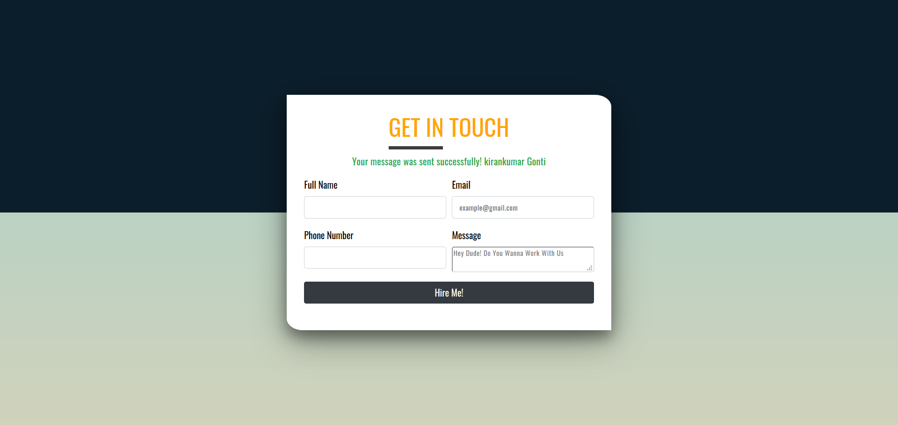
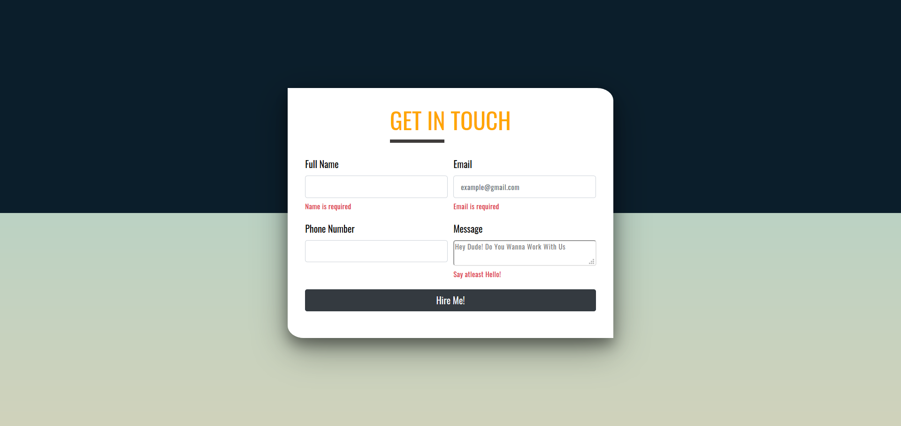
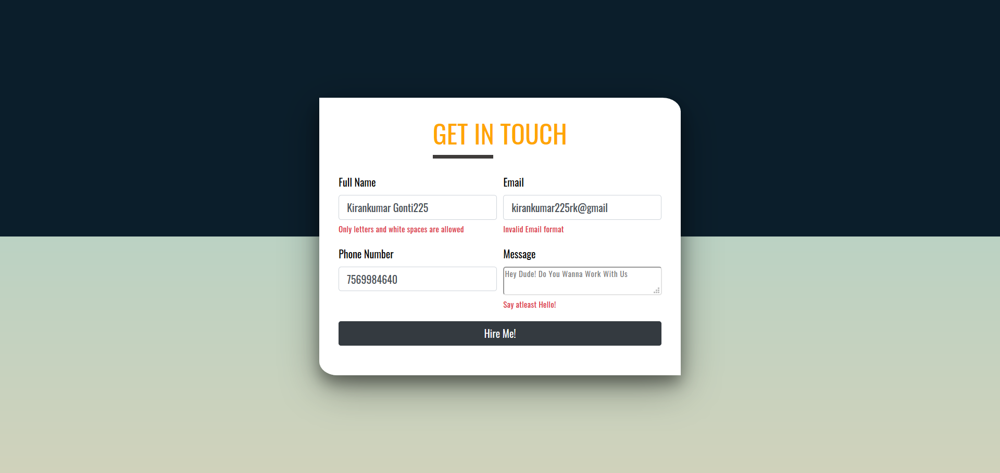

# **Sending Contact Form Details From your Website to the Gmail Account Using PHPMailer()**
## **Project Setup**
1. Download PHPMailer: https://github.com/PHPMailer/PHPMailer/archive/5.2-stable.zip
2. Extract the downloaded zip file on your computer.
3. Rename the extracted folder to PHPMailer.

4.  It must present in the root directory of your project.

5. Then Do Some Changes in contact.php file which is present in the includes folder in order to work this project

6.     $mail->Username = "your Gmail address example@gmail.com"; // Your Gmai address.

7.     $mail->Password = "your Gmail password"; // Your Gmail login password or App Specific Password.

8.     $mail->addAddress('recipient Gmail address example@gmail.com'); // Set the recipient of the message.

9. in order to work This PHPMailer you should turn off the  **2-Step- Verification** for the google account you want to send messages click the below link to navigate to that page.      
https://myaccount.google.com/security

10. and the next thing is should turn On the
 **Less secure app access** on the same page of your google account click the below link to navigate to that page.   
 https://myaccount.google.com/security

## **ProjectSnapshot**

## **Form-Validation Snapshots**
1. Fileds Can't be Blank

2. We Follow some Rules!

## **Error Messages**

1. ### **smtp connect() failed. https://github.com/phpmailer/phpmailer/wiki/troubleshooting**

    ### If your getting this error on your website that maens that hosting provider will not allow you to connect to SMTP Connection. Most Of the Free Hosting Services  Doesn't allow you to send messages using SMTP Connection.
